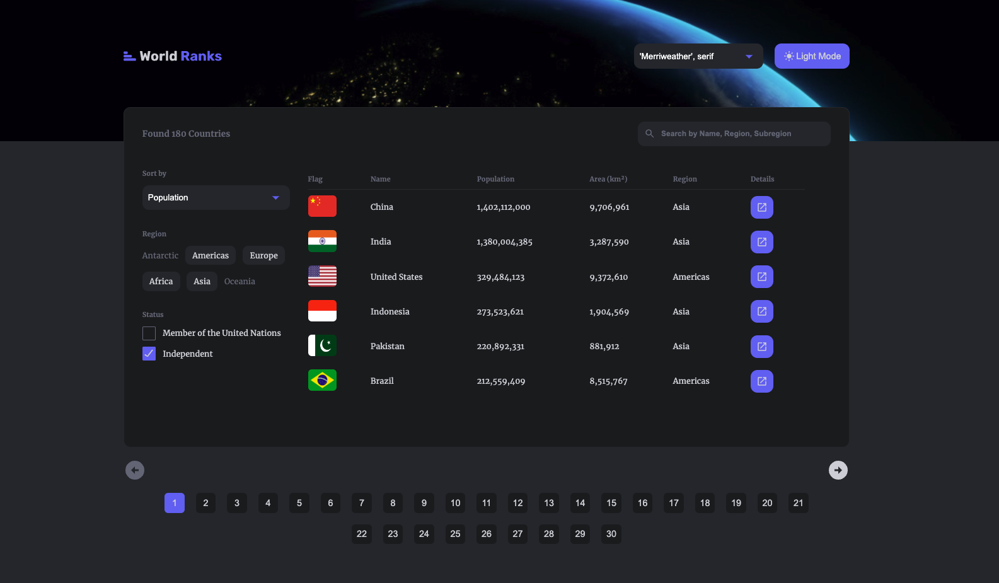
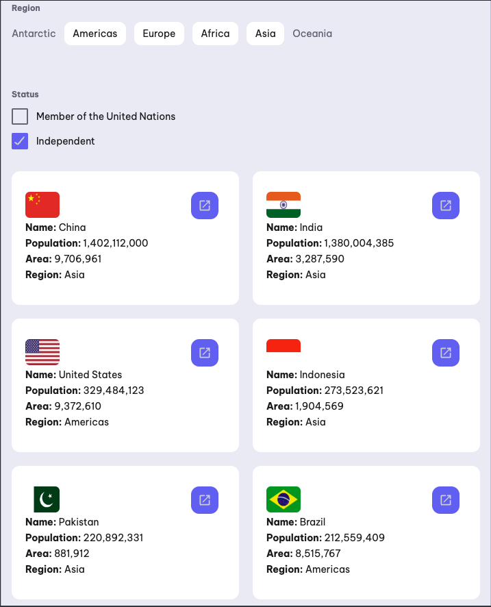
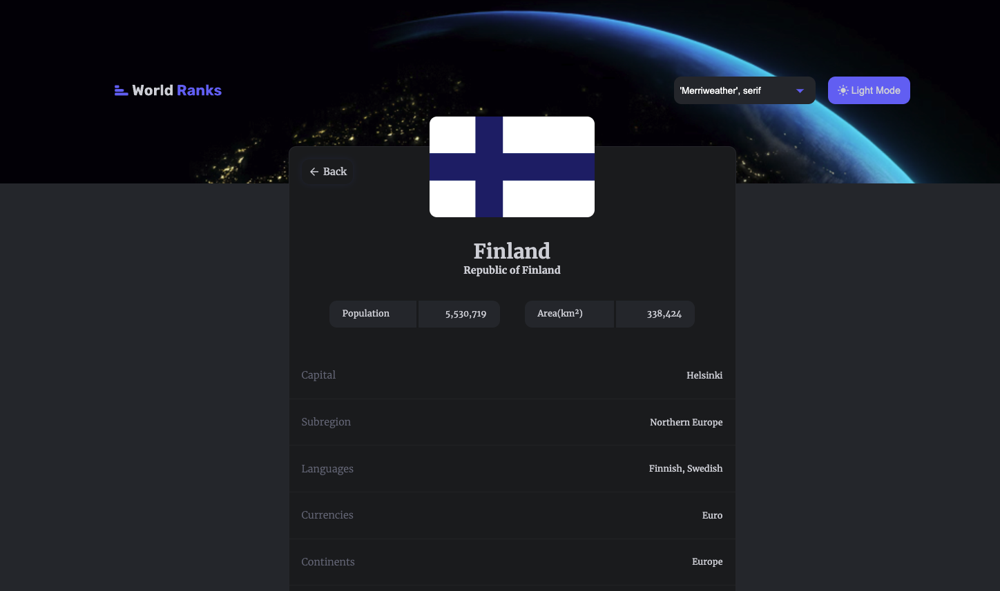
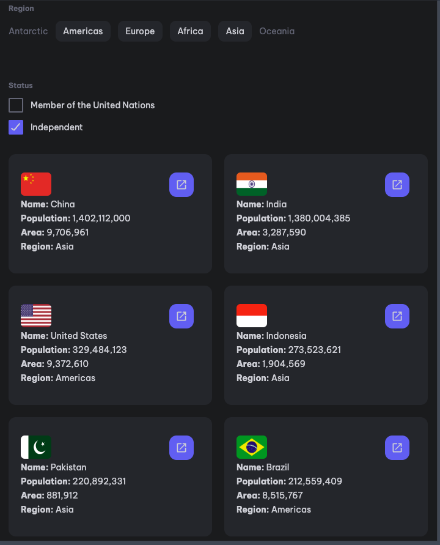

# CountryRank

Live Site: https://victorkevz.github.io/country-rank/
Repository: https://github.com/VictorKevz/country-rank.git

# Motivation

The primary motivation for this project was to get comfortable working with APIs, Context API, and useReducer. I wanted to practice handling complex states, API data management, and rendering lists with features like sorting, filtering, and searching. This project also provided an opportunity to dive deeper into built-in JavaScript functions such as filter, map, and sort. By implementing these functions, I aimed to enhance my problem-solving skills and improve my ability to manage dynamic and interactive data.

# Features

- Dark/Light Theme Toggle: Switch between dark and light themes, with preferences saved in localStorage for consistency across sessions.
- Font Switch: A seamless font style toggle, allowing users to select their preferred font, which is also saved in localStorage.
- Fully Responsive Table: The page features a fully responsive table that transforms into a card layout on mobile devices.
- Hover States with translateX: Hover effects applied on table and card items with smooth transitions using the translateX property, creating an interactive and polished UI.
- Keyboard Focusable & Accessible: The site is designed with accessibility in mind. Elements like pagination and buttons are keyboard-focusable and accessible, ensuring a smooth user experience for all.
- Local Storage for Preferences: User preferences for theme and font choice are stored in localStorage, ensuring the settings persist even after a page reload or future visits.
- Pagination: Efficient pagination that allows easy navigation through a large set of country data, with simple next/previous controls.
- Search, Filter, and Sort: Ability to search countries by name, region, or subregion, and filter/sort based on various attributes like population and area.

# Tech Stack

- React for building the UI components and managing the state
- useReducer for handling complex state logic, especially related to API data and user preferences
- CSS (with CSS modules or Tailwind CSS) for styling and responsive design
- JavaScript Array Functions like map, filter, and sort for managing and displaying data dynamically

# Installation

To run the project locally, follow these steps:

- Clone the repository:
  `git clone https://github.com/VictorKevz/country-rank.git`
- Navigate into the project directory:  
   `cd country-rank`
- Install the dependencies:
  `npm install`
- Start the development server:
  `npm run dev`

 
